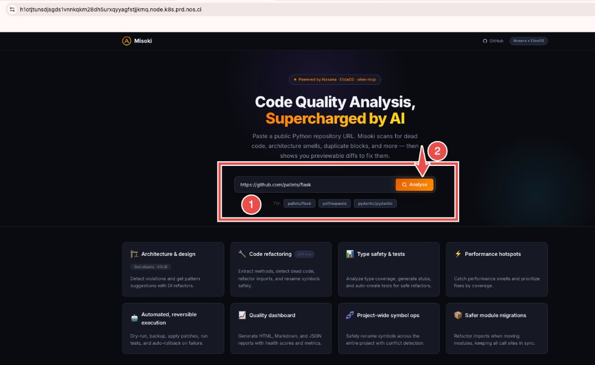
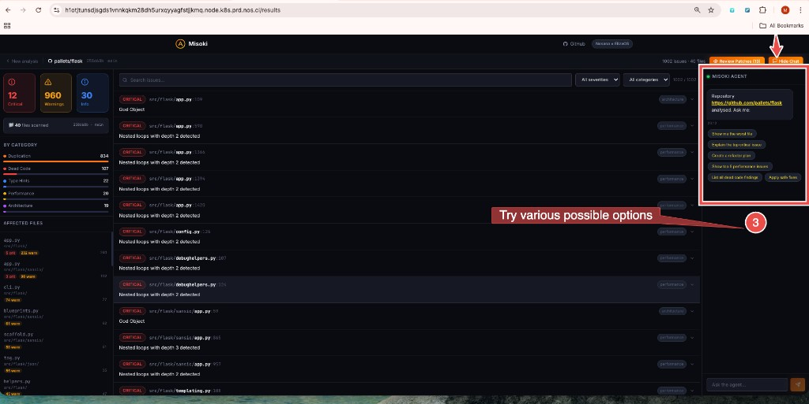
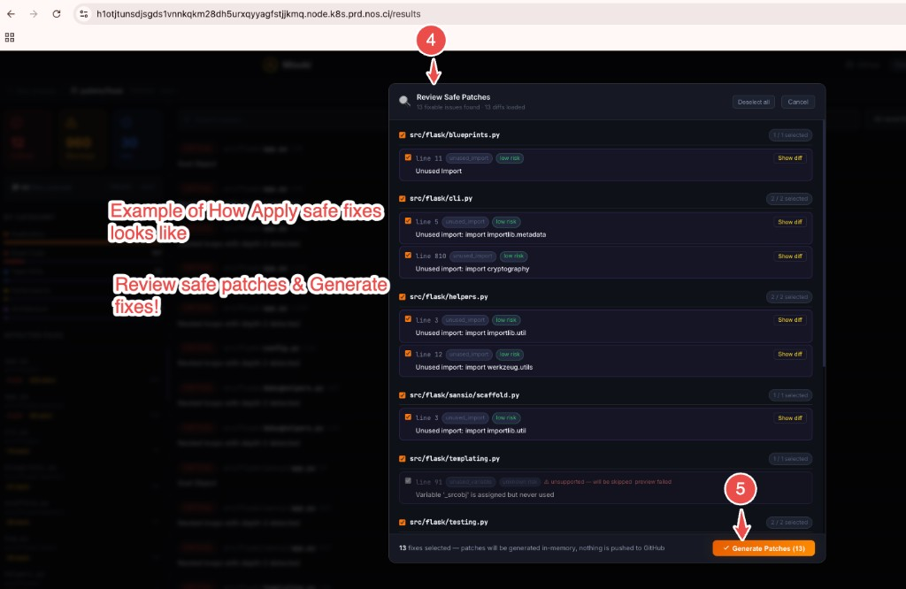
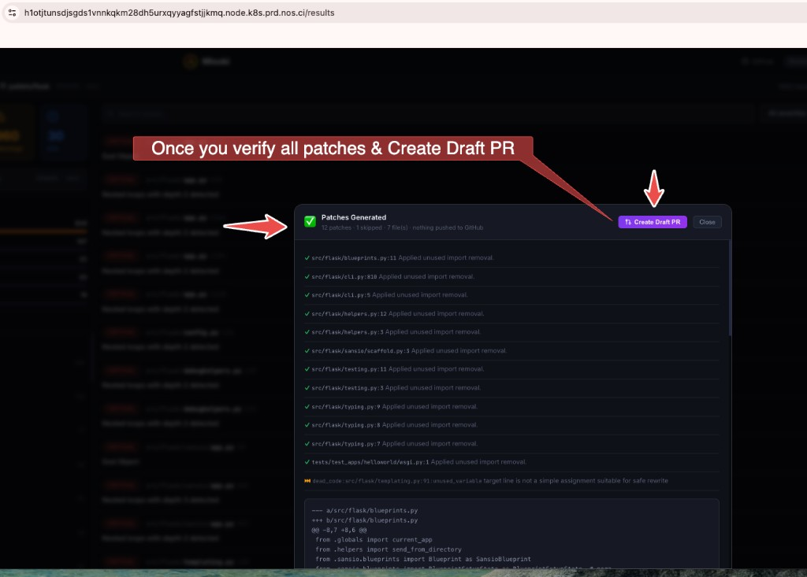

# Misoki — Scan. Explain. Patch. PR. · ElizaOS on Nosana

**Misoki** is a full-stack companion for the [Nosana × ElizaOS Agent Challenge](https://nosana.com/blog/builders-challenge-elizaos/): it analyzes **public Python** repositories, surfaces actionable issues, and pairs a **custom Next.js UI** with an **ElizaOS** agent named **Misoki** so you can explore findings, apply safe patches, and open draft PRs when your GitHub token allows.

The Python analysis engine reuses **[ohm-mcp](https://github.com/Murugarajr/ohm-mcp)** — an AST-first refactoring and code-quality toolkit (also published for MCP clients such as Copilot, Cursor, and Cline; see that repo for capabilities, tools, and [PyPI `ohm-mcp`](https://pypi.org/project/ohm-mcp/)). Misoki vendors a snapshot under `analysis-service/vendor/ohm-mcp-src/` for reproducible Docker / Nosana builds.

---

## Agent description

Misoki is a **personal AI coding assistant for Python** — not a wall of passive warnings. The stack brings together:

- **Next.js** — product UI  
- **ElizaOS** — the Misoki agent  
- **FastAPI** — analysis service built on **[ohm-mcp](https://github.com/Murugarajr/ohm-mcp)** (AST-first refactoring and quality; same capability family as the MCP tools for Copilot, Cursor, and Cline)  

That depth is **more than a single “lint score.”** Misoki leans on signals such as:

| Area | Examples |
|------|----------|
| **Architecture** | God-object and SOLID-oriented hints, design and dependency-injection style guidance |
| **Code quality** | Extract-method-style reasoning, dead-code and import cleanup, duplication, project-aware symbol renaming |
| **Types & tests** | Coverage-oriented analysis and test-generation thinking where it fits |
| **Performance** | Nested-loop and hotspot-style findings |

**In the UI:** scan public GitHub repos, browse the issue dashboard, use suggested prompts, and **Review Patches** before anything lands in your tree. With the right GitHub scopes, **Create Draft PR** turns that work into a forked branch and pull request. Chat still covers follow-ups (worst file, criticals, refactor plans, safe fixes).

The project is built for the **Nosana × ElizaOS** challenge and is **fully containerized** — run locally or ship an all-in-one image for decentralized deploys. Misoki is aimed at developers who want **refactoring-grade, ohm-mcp-class** analysis under an agent they steer, instead of another static report.

### Screenshots

Misoki on Nosana — example flow (public Python repo, e.g. `pallets/flask`):

1. **Scan** — Paste a GitHub URL on the landing page and run **Analyse**.

   

2. **Explain** — Review severity, categories, and issues; use **Review Patches** and the **Misoki agent** chat (suggested prompts or free-form questions).

   

3. **Patch** — In **Review Safe Patches**, select low-risk fixes, open **Show diff** as needed, then **Generate Patches** (in-memory until you choose PR).

   

4. **PR** — In **Patches Generated**, confirm applied fixes and the combined diff, then **Create Draft PR** when your GitHub token allows.

   

### Demo video

- **Watch:** [Misoki demo — Nosana × ElizaOS build challenge](https://youtu.be/239lme2XyYM)

[](https://youtu.be/239lme2XyYM)

---

## Architecture

**Diagram (logical — Docker Compose):** three processes; the browser hits only the web app; Next.js proxies API traffic server-side.

```
                         ┌──────────────────────────────────────────┐
                         │             Browser                      │
                         └────────────────────┬─────────────────────┘
                                              │ same-origin to Misoki UI
                         ┌────────────────────▼─────────────────────┐
                         │ Next.js — UI + /api/analysis + /api/agent│
                         │  Compose: published :8080 → app :3000    │
                         └───────────┬─────────────────┬────────────┘
                                     │                 │
                         server proxy to backends (Docker service names or localhost)
                                     │                 │
                         ┌───────────▼─────────┐ ┌─────▼──────────────┐
                         │ FastAPI Analysis    │ │ ElizaOS — Misoki   │
                         │ :8000               │ │ :3000              │
                         │ ohm-mcp AST         │ │ Misoki plugin      │
                         └───────────┬─────────┘ └─────────┬──────────┘
                                     │                     │
                                     │ MISOKI_ANALYSIS_    │
                                     │ SERVICE_URL         │
                                     │◄────────────────────┘
                                     │
                                     ▼
                         ┌─────────────────────────────────────────┐
                         │ GitHub API (token on web + analysis)    │
                         └─────────────────────────────────────────┘
```

**Nosana all-in-one (`Dockerfile.nosana`):** same three tiers run inside one container; services talk on `localhost:8000`, `:3000`, `:8080`; only **8080** is exposed publicly.

| Layer | Tech | Role |
|-------|------|------|
| **Web** | Next.js 16 (App Router), standalone output | Landing page, results dashboard, chat panel, Review Patches modal, Create Draft PR |
| **Agent** | ElizaOS (Node 23, Bun/pnpm), parent `Dockerfile.local` | Orchestration, memory, Misoki actions (analyze, explain, refactor plan, safe fixes, PR) |
| **Analysis** | Python 3.11, FastAPI | AST-backed analysis, GitHub fetch, batch preview, apply-fix; **[ohm-mcp](https://github.com/Murugarajr/ohm-mcp)** vendored in the image |

```
Browser  →  Web (:8080 local via compose)
              ├─ /api/analysis/*  →  FastAPI (:8000)
              └─ /api/agent/*     →  ElizaOS (:3000)
```

The browser only talks to the **web** origin. Next.js **API route proxies** (`web/src/app/api/analysis/[...path]/`, `web/src/app/api/agent/[...path]/`) forward to `ANALYSIS_SERVICE_URL` and `AGENT_URL` at **runtime** (required in Docker so build-time rewrites are not used).

---

## Repository layout (this tree)

```
misoki-mcp-ac/
├── analysis-service/     # FastAPI app, Dockerfile, vendor/ohm-mcp-src (baked for deploy)
├── web/                  # Next.js frontend + API proxies
├── scripts/
│   ├── free-ports.sh     # Optional: free 8000/3000/8080 before compose (see start.sh)
│   ├── start.sh          # free-ports + docker compose up --build
│   └── start-nosana.sh   # Used by ../Dockerfile.nosana (all-in-one image)
├── docker-compose.yml    # 3 services: analysis-service, agent, web
└── DEPLOYMENT.md         # Extended deploy / health / troubleshooting
```

Parent repo (challenge root):

- `Dockerfile.local` — ElizaOS **agent-only** image for Docker Compose (build context: repo root).
- `Dockerfile.nosana` — **single container**: analysis + agent + web on `localhost`, **expose 8080** for Nosana.
- `nos_job_def/nosana_eliza_job_definition.json` — recommended **dashboard** job (single op, `misoki/misoki-all:latest`).

---

## Features (implemented)

- **Analyze** public GitHub repos from the UI; severity/category breakdown and issue list.
- **Review Patches** — preview and generate patches for safe fix types.
- **Create Draft PR** — Next.js route uses `GITHUB_TOKEN` when scopes allow (`public_repo` / `repo` as appropriate).
- **Ask Misoki** — chat sidebar; suggested prompts; **Apply safe fixes** opens Review Patches; Misoki agent id discovered at runtime.
- **Analysis service** — concurrent GitHub fetches, retries, configurable timeouts; **ohm-mcp** source copied into `analysis-service/vendor/ohm-mcp-src` at build time (no host volume mount needed for cloud deploy).

---

## Local development

### Prerequisites

- Docker / Docker Compose  
- From repo root: `.env` or `misoki-mcp-ac/.env` with `NOSANA_MODEL_ENDPOINT`, `NOSANA_API_KEY`, optional `GITHUB_TOKEN`

### Run the stack

```bash
cd misoki-mcp-ac
cp .env.example .env   # if you use an example; then edit
./scripts/start.sh     # frees common ports + docker compose up --build
# or: docker compose up --build
```

| Service | URL (host) |
|---------|------------|
| Web | http://localhost:8080 |
| Agent (Eliza built-in UI) | http://localhost:3000 |
| Analysis API (direct) | http://localhost:8000 — `/health`, `/docs`, `/analyze/repo`, etc. |

Compose wiring matches `docker-compose.yml`: agent waits for a healthy analysis-service; web depends on both and sets `ANALYSIS_SERVICE_URL` / `AGENT_URL` for server-side proxying.

### Ports in use

If bind errors occur, use `./scripts/free-ports.sh` or `./scripts/start.sh` (see `scripts/free-ports.sh` — it targets listeners and avoids killing Docker’s own processes when possible).

---

## ohm-mcp dependency (analysis-service)

Upstream project: **[github.com/Murugarajr/ohm-mcp](https://github.com/Murugarajr/ohm-mcp)** (MCP server, IDE integration, full tool list).

The analysis engine expects **ohm-mcp** on disk. For production and Nosana:

- Source lives under `analysis-service/vendor/ohm-mcp-src/` (copy of the `ohm_mcp` package from that repo).
- `Dockerfile` sets `ENV OHM_MCP_SRC_PATH=/app/vendor/ohm-mcp-src`.
- `docker-compose.yml` does **not** mount a host path for ohm-mcp.

Local dev without rebuilding: you can still align with `OHM_MCP_SRC_PATH` if you customize `.env`, but the default image is self-contained.

---

## Nosana deployment

Nosana multi-container jobs can hit **DNS / ordering** quirks between operations. The supported path for a stable dashboard deploy is the **all-in-one** image:

1. From **repository root** (`agent-challenge/`), build and push:

   ```bash
   docker build -f Dockerfile.nosana -t YOUR_USER/misoki-all:latest .
   docker push YOUR_USER/misoki-all:latest
   ```

2. Edit `nos_job_def/nosana_eliza_job_definition.json`: set `image` to your image, and supply env (model URL, API key, GitHub token, Misoki limits). **Do not commit real tokens.**

3. Paste the JSON into the [Nosana Dashboard](https://deploy.nosana.com/) deploy flow. The job exposes **8080** — use that URL as your public Misoki UI.

Secrets: there is no separate “dashboard secrets” UI for arbitrary env injection like `{{ secrets.X }}` in JSON; use [confidential jobs via CLI](https://learn.nosana.com/deployments/jobs/job-definition/confidential.html) if you must avoid publishing tokens in IPFS-hosted definitions.

More detail: **`DEPLOYMENT.md`** in this folder.

---

## Environment variables (summary)

| Variable | Where | Purpose |
|----------|--------|---------|
| `NOSANA_MODEL_ENDPOINT` / `NOSANA_API_KEY` | Agent (compose) | OpenAI-compatible LLM (Nosana Qwen endpoint) |
| `OPENAI_SMALL_MODEL` / `OPENAI_LARGE_MODEL` | Agent | Model ids for the endpoint |
| `MISOKI_ANALYSIS_SERVICE_URL` | Agent | FastAPI base URL |
| `MISOKI_ANALYSIS_MAX_FILES`, `MISOKI_ANALYSIS_TIMEOUT_MS` | Agent | Background analysis limits |
| `ANALYSIS_SERVICE_URL`, `AGENT_URL` | Web (server) | Proxy targets for `/api/analysis/*`, `/api/agent/*` |
| `GITHUB_TOKEN` | Web, analysis | Private repo access; PR route needs appropriate scopes |
| `MISOKI_*` | Analysis | GitHub API base, file limits, HTTP timeouts |

---

## Health & debugging

| Check | URL |
|-------|-----|
| Analysis | `GET /health` on port 8000 |
| Web | `GET /api/health` (inside Next) |
| Agent | Eliza `/health` / logs via `docker compose logs agent` |

```bash
docker compose logs -f analysis-service web agent
```

---

## Related docs

- Misoki stack (detailed copy): [`misoki-mcp-ac/README.md`](misoki-mcp-ac/README.md)
- **ohm-mcp** (analysis engine source & MCP tooling): [github.com/Murugarajr/ohm-mcp](https://github.com/Murugarajr/ohm-mcp)

---

**Misoki** — analyze, chat, patch, and ship on your own stack or on **Nosana** decentralized compute, with ElizaOS and a real Python analysis engine under the hood.
